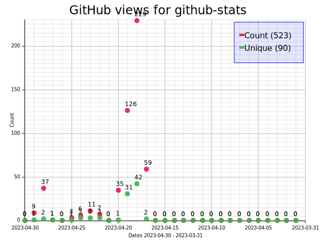
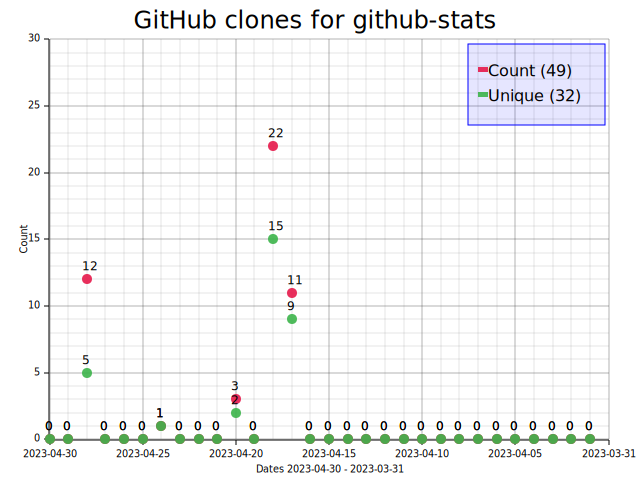

# github-stats


Generate GitHub traffic statistics SVG charts.

Traffic statistics for views and clones are downloaded from GitHub API to a local SQLite database.

GitHub keeps these statistics only for 14 days. With this program you can keep infinite days in local database and update the statistics once per day.

Example for this project:




## Usage

```
% github-stats --help
Generate project traffic statistics charts from GitHub API

Usage: github-stats [OPTIONS] <COMMAND>

Commands:
  fetch       Fetch traffic statistics from Github to a local database
  list-repos  List repositories found in local database
  stats       Generate statistics for repo from local database
  generate    Generate all statistics from local database
  help        Print this message or the help of the given subcommand(s)

Options:
  -v, --verbose          Be verbose?
  -c, --config <CONFIG>  Config file [default: config.toml]
  -h, --help             Print help
  -V, --version          Print version
```

## Setting up

First copy `config.example.toml` to `config.toml` and edit the config with your favorite editor.
[Generate](https://github.com/settings/tokens) new API key or use existing one.

## Example:

Fetch latest statistics from GitHub to local database:

```shell
github-stats fetch
```

Note: data from GitHub API is cached for one hour in `cache` directory.

Generate SVG chart for a repository named *heksa*:

```shell
github-stats stats heksa
```

The generated chart is saved to `stats` directory. Stats for last 30 days is displayed.

Now you can for example copy the result to your web page and for example display the chart in your project's `README.md`.

Generate all statistics charts at once:

```shell
github-stats generate
```

See [example](example) directory for how to automate updates with systemd.

## Internals

* [reqwest](https://crates.io/crates/reqwest) as HTTP client
* [rusqlite](https://crates.io/crates/rusqlite) as SQLite library
* [plotters](https://crates.io/crates/plotters) as SVG renderer

## Is it any good?

Yes.
